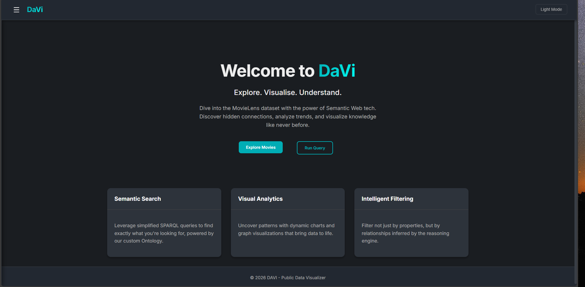
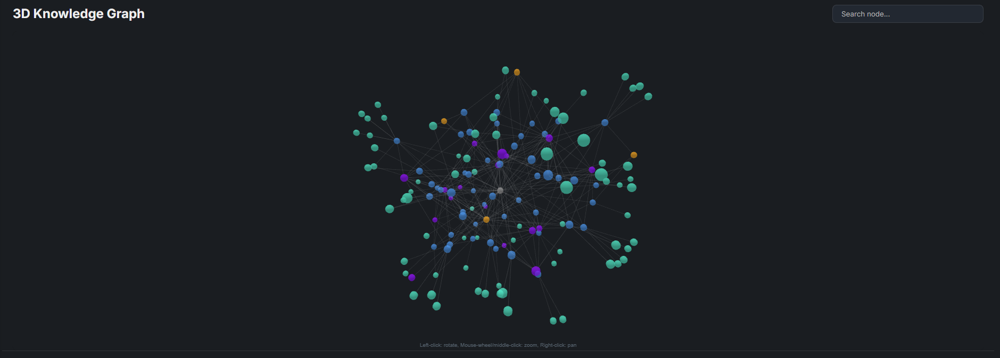
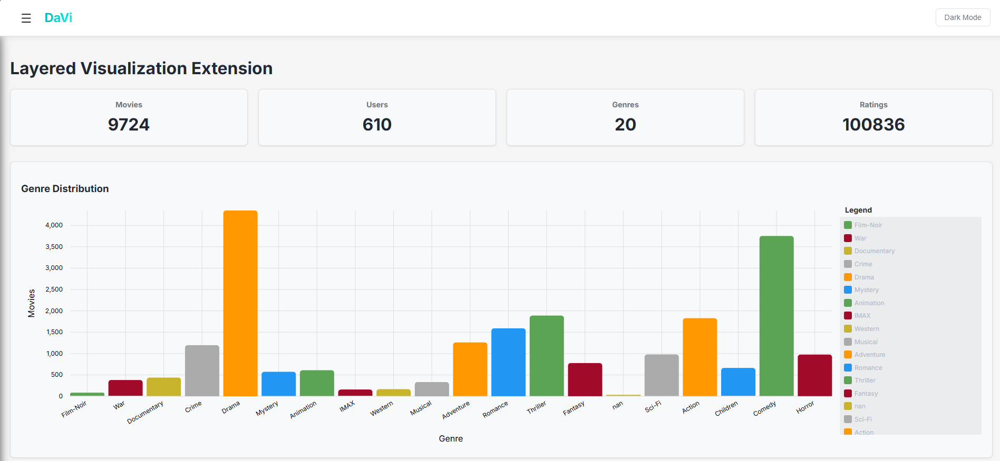
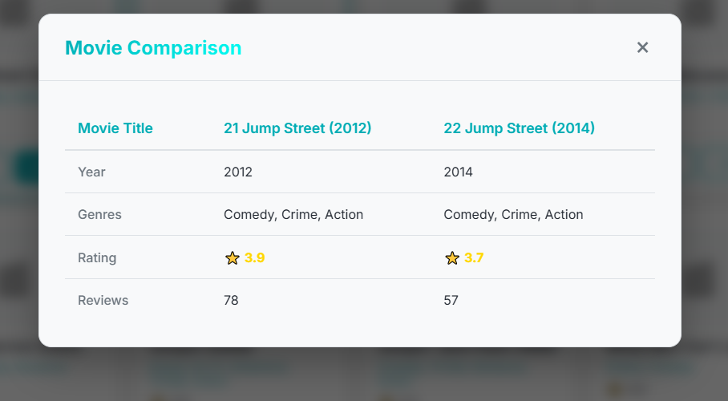

<div align="center">

  
  <h1>DAVI - WADe MovieLens API</h1>
  
  <p>
    An intelligent semantic web application for exploring MovieLens data using ontology-based reasoning and SPARQL!
  </p>
  
  
<p>
  <a href="">
    
  </a>
  <a href="">
    
  </a>
  <a href="">
    
  </a>
  <a href="">
    
  </a>
  <a href="">
    
  </a>
  <a href="">
    
  </a>
</p>
   
<h4>
    <a href="#camera-screenshots">View Demo</a>
  <span> · </span>
    <a href="#toolbox-getting-started">Documentation</a>
  <span> · </span>
    <a href="https://github.com/Ana-Maria-C/DAVI/issues">Report Bug</a>
  <span> · </span>
    <a href="https://github.com/Ana-Maria-C/DAVI/issues">Request Feature</a>
  </h4>
</div>

<br />

# :notebook_with_decorative_cover: Table of Contents

- [About the Project](#star2-about-the-project)
  * [Screenshots](#camera-screenshots)
  * [Tech Stack](#space_invader-tech-stack)
  * [Features](#dart-features)
- [Getting Started](#toolbox-getting-started)
  * [Prerequisites](#bangbang-prerequisites)
  * [Installation](#gear-installation)
  * [Run Locally](#running-run-locally)
  * [Deployment](#triangular_flag_on_post-deployment)
- [Usage](#eyes-usage)
- [Roadmap](#compass-roadmap)
- [Contributing](#wave-contributing)
- [FAQ](#grey_question-faq)
- [License](#warning-license)
- [Contact](#handshake-contact)
- [Acknowledgements](#gem-acknowledgements)

  

## :star2: About the Project

**DAVI** is a robust semantic web platform engineered to interface with the MovieLens dataset. It uses a custom ontology to structure data and Apache Jena Fuseki to provide a powerful SPARQL endpoint. The project aims to facilitate complex semantic queries, intelligent filtering based on inferred relationships, and dynamic data visualization (using 3D Force Graph).

### :camera: Screenshots

<div align="center"> 
  
  <p><em>Main Dashboard - Explore movies with smart filters</em></p>
</div>

<br />

<div align="center"> 
  
  <p><em>3D Force-Directed Graph - Visualizing relationships between Movies, Genres, and Tags</em></p>
</div>

<br />

<div align="center"> 
  
  <p><em>Analytics - Real-time statistics and distribution charts</em></p>
</div>

<br />

<div align="center"> 
  
  <p><em>Movie Comparison - Side-by-side analysis of attributes</em></p>
</div>


### :space_invader: Tech Stack

<details>
  <summary>Client</summary>
  <ul>
    <li><a href="https://angular.io/">Angular 21</a></li>
    <li><a href="https://github.com/vasturiano/3d-force-graph">3d-force-graph</a></li>
    <li><a href="https://swimlane.github.io/ngx-charts/">ngx-charts</a></li>
    <li><a href="https://material.angular.io/">Angular Material</a></li>
    <li><a href="https://rxjs.dev/">RxJS</a></li>
  </ul>
</details>

<details>
  <summary>Server</summary>
  <ul>
    <li><a href="https://fastapi.tiangolo.com/">FastAPI</a></li>
    <li><a href="https://www.python.org/">Python 3.9+</a></li>
    <li><a href="https://rdflib.readthedocs.io/">RDFLib</a></li>
    <li><a href="https://rdflib.github.io/sparqlwrapper/">SPARQLWrapper</a></li>
  </ul>
</details>

<details>
  <summary>Database</summary>
  <ul>
    <li><a href="https://jena.apache.org/documentation/fuseki2/">Apache Jena Fuseki</a></li>
    <li><a href="https://www.w3.org/TR/sparql11-query/">SPARQL 1.1</a></li>
    <li><a href="https://www.w3.org/TR/rdf11-primer/">RDF/Turtle</a></li>
  </ul>
</details>

<details>
  <summary>DevOps</summary>
  <ul>
    <li><a href="https://www.docker.com/">Docker</a></li>
    <li><a href="https://docs.docker.com/compose/">Docker Compose</a></li>
  </ul>
</details>

### :dart: Features

- **Semantic Querying**: Advanced SPARQL integration for deep data retrieval.
- **Interactive Visualization**: Explore the movie knowledge graph in 3D using force-directed graphs.
- **Ontology Awareness**: Fully compliant with a custom `schema.ttl` for strict data structuring.
- **Smart Filtering**: Filter movies by Genre, Year, and Rating using semantic queries.
- **Data Analysis**: Visual analytics of movie distribution and trends.
- **RESTful Architecture**: Clean, documented API endpoints via FastAPI.

## 	:toolbox: Getting Started

### :bangbang: Prerequisites

This project uses Docker, Python, and Node.js.

* Docker
  ```bash
  docker --version
  ```
* Python
  ```bash
  python --version
  ```
* Node.js & npm (for Frontend)
  ```bash
  node --version
  npm --version
  ```

### :gear: Installation

1. **Clone the project**

```bash
  git clone https://github.com/Ana-Maria-C/DAVI.git
  cd DAVI
```

2. **Install Backend Dependencies**

```bash
  cd backend
  python -m venv .venv
  # Windows
  .venv\Scripts\activate
  # Linux/Mac
  source .venv/bin/activate
  
  pip install -r requirements.txt
```

3. **Install Frontend Dependencies**

```bash
  cd ../frontend
  npm install
```
   
### :running: Run Locally

1. **Start the Database (Fuseki)**

```bash
  # In the root directory
  docker-compose up -d
```

2. **Initialize Data** (First time only)

```bash
  # Ensure Python venv is active
  python data/upload_to_fuseki.py
```

3. **Start the Backend Server**

```bash
  cd backend
  python -m uvicorn app.main:app --reload
```
The server will run at `http://localhost:8000`.

4. **Start the Frontend Application**

```bash
  cd frontend
  npm start
```
The application will run at `http://localhost:4200`.

### :triangular_flag_on_post: Deployment

To deploy the entire stack using Docker Compose:

```bash
  docker-compose up -d --build
```


## :eyes: Usage

- **Web Interface**: Go to `http://localhost:4200` to browse movies, visualize the graph, and analyze data.
- **API Docs**: Visit `http://localhost:8000/docs` to interact with the Swagger UI.
- **SPARQL Endpoint**: Query the Fuseki server directly at `http://localhost:3030/movielens/sparql`.


## :compass: Roadmap

* [x] Basic Ontology Design
* [x] FastAPI Service Skeleton
* [x] Fuseki Integration
* [x] Angular Frontend Implementation
* [x] 3D Graph Visualization

## :wave: Contributing

<a href="">
  
</a>


Contributions are always welcome!

See `contributing.md` for ways to get started.


## :grey_question: FAQ

- **How do I reset the database?**

  + Delete the `data/fuseki_data` folder and restart the Docker container, then run `python data/upload_to_fuseki.py` again.

- **Where is the ontology file?**

  + It is located in `ontology/schema.ttl`.


## :warning: License

Distributed under the MIT License.


## :package: Deliverables

Here you can find all the resources and documentation related to the DAVI project.

### Source Code
The complete source code is hosted on GitHub:
*   [**Repository Link**](https://github.com/Ana-Maria-C/DAVI)

### Documentation
*   **Scholarly HTML (Report)**: [scholarly/scholarly.html](scholarly/scholarly.html)
*   **API Documentation**: [Swagger UI](http://localhost:8000/docs) *(runs locally)*
*   **OpenAPI Spec**: [openapi.json](http://localhost:8000/openapi.json)

### Demo
*   **Video Presentation**: [YouTube Link](https://youtu.be/-yhS_3Q5puw)

### References
*   [MovieLens Dataset](https://grouplens.org/datasets/movielens/)
*   [W3C SPARQL 1.1](https://www.w3.org/TR/sparql11-query/)


## :gem: Acknowledgements

 - [Awesome Readme Template](https://github.com/Louis3797/awesome-readme-template)
 - [MovieLens Dataset](https://grouplens.org/datasets/movielens/)
 - [FastAPI](https://fastapi.tiangolo.com/)
 - [Apache Jena](https://jena.apache.org/)
 - [Angular](https://angular.io/)
 - [3d-force-graph](https://github.com/vasturiano/3d-force-graph)
